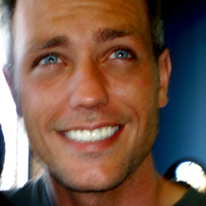

# cse136-team-5-page
This is team 5 introduction page

## Setup
To all you need to do is run `bower install` from the root directory of the project. If you do not already have bower 
installed follow instruction [here](http://bower.io/#install-bower).

## Add your info!
To add your profile just copy and paste the following and add your info.
```html
<!-- START PROFILE -->
<section class="col-sm-6 panel panel-default panel-profile">
    <div class="panel-heading bg-faded m-b-0"
         style="background-image: url(https://unsplash.it/200/300/?random&blur);"></div>
    <div class="panel-body">
        <div class="text-xs-center">
            
            <h5 class="panel-title">Kyly G. Vass</h5>
        </div>
        <div class="profile-info">
            <dl>
                <dt>About</dt>
                <dd>Went to school originally for graphic design a long, long, time ago but never really
                    finished.
                    This time around of I am going all the way with computer science. I have worked as a
                    contractor
                    do some development for various companies over the past couple of years. Had a short
                    internship
                    with at Achieve Internet. Now I am working for Ingenue doing enterprise development for the
                    first
                    machine to machine nation wide network.
                </dd>
                <dt>Phone</dt>
                <dd>(702) 533-5959</dd>
                <dt>Email</dt>
                <dd>kvass@ucsd.edu</dd>
            </dl>
        </div>
    </div>
</section>
<!-- END PROFILE -->
```

Add you profile image to `www/image/` directory and swap out the image link in the template. You can add your own panel
heading image too. For mine I am just pulling a random image from https://unsplash.it.